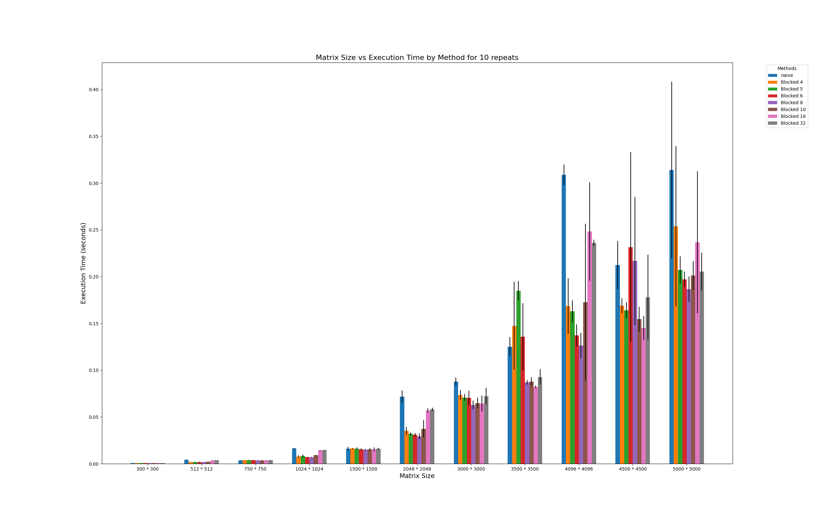
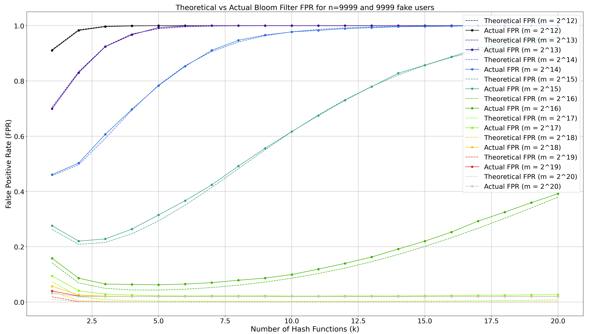

# Assignment 1 – Algorithm Engineering

## Project Highlights

### 1. Blocked Matrix Rotation (C++)

- Implements a cache-efficient matrix rotation algorithm using block-based optimization.
- Benchmarked using `rotmatrix.py` with matrix sizes from 3x3 to 5000x5000.
- Achieved significant speedup with optimal block size (10×10) on large matrices.
- Includes performance graph comparing naive vs blocked strategies.

### 2. Bloom Filter (Java)

- Implements a probabilistic data structure for set membership testing.
- Uses MurmurHash with custom bit array logic (no BitSet).
- Includes theoretical vs actual false positive rate (FPR) analysis.
- Python script automates FPR benchmarking across multiple configurations.

### 3. Radix Sort (Java)

- Implements both LSD and MSD variants of Radix Sort for ASCII strings.
- MSD variant includes cutoff logic to switch to Insertion Sort for small bins.
- Benchmarked against Java’s built-in `Arrays.sort()` on large datasets (up to 1M strings).
- MSD Radix Sort outperformed Java’s sort in multiple scenarios.

---

## 📊 Benchmarks & Results

### Matrix Rotation Performance



This graph compares execution times for different matrix sizes and block sizes. The 10×10 block size showed the best performance on large matrices.

---

### Bloom Filter False Positive Rate



This graph shows theoretical vs actual false positive rates for various bit array sizes and hash counts. The results align closely with theoretical predictions.

---

### Radix Sort Benchmark Table

| Array | Java Arrays.sort() (ns) | LSD Radix Sort (ns) | MSD Radix Sort w/ cuttoff 0 (ns) | MSD Radix Sort w/ cuttoff 5 (ns) |
|--------------|--------------------------|----------------------|----------------------|----------------------|
|1st array (banana, apple, ...) | 25401 | 51939 | 11336| 794
|2nd array (c3e, bfr, aAD, ...) | 9237 | 34944 | 13231 | 13328 
|3rd array (random)           | 50394849 | 4779757140 | 245544066 | 234659510

The LSD Radix Sort performed worst overall, particularly on variable-length strings due to padding overhead. MSD Radix Sort showed competitive performance, surpassing Java’s built-in sort in two out of three test cases. Interestingly, varying the cutoff threshold for switching to Insertion Sort had negligible impact, with differences falling within statistical error margins.

---

## 🛠️ How to Run

### Matrix Rotation

```bash
g++ matrix_rotation.cpp -o matrix_rotation
python3 rotmatrix.py input_matrix.txt 4 8 16
```

### Bloom Filter
```bash
cd BloomFilter
make compile
make run
```

### Radix Sort
```bash
cd RadixSort
javac RadixSort.java
java RadixSort
```

Code tested with python 3.12 and Java 11.0.26

## License
This work is licensed under the Creative Commons Attribution 4.0 International License.

## Contributions
This repository is a personal academic archive and is not open for contributions.
